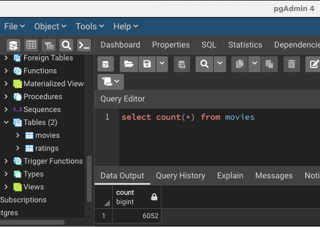

# Movies-ETL

## Overview
The purpose of this project was to gain experience in extracting, transforming and loading data. The scenario was to build a data file which hackathon participants could use for their contest. 

Data for this assignment came from three sources:

* JSON file from Wikipedia on movies.
* MovieLens data in csv format.
* Ratings on movies in csv format.

## Results

The transformation process was intense. After removing unnecessary data, formatting data and combining data, I was able to load it into a database.

At completion, 6,052 movies were loaded into the movies table:
  
 
In addition, 26,024,289 ratings were loaded into the ratings table for the hackathon participants to use:
  
 
## Summary

The database is now ready for hackathoners to utilize for their analyses on movies!
